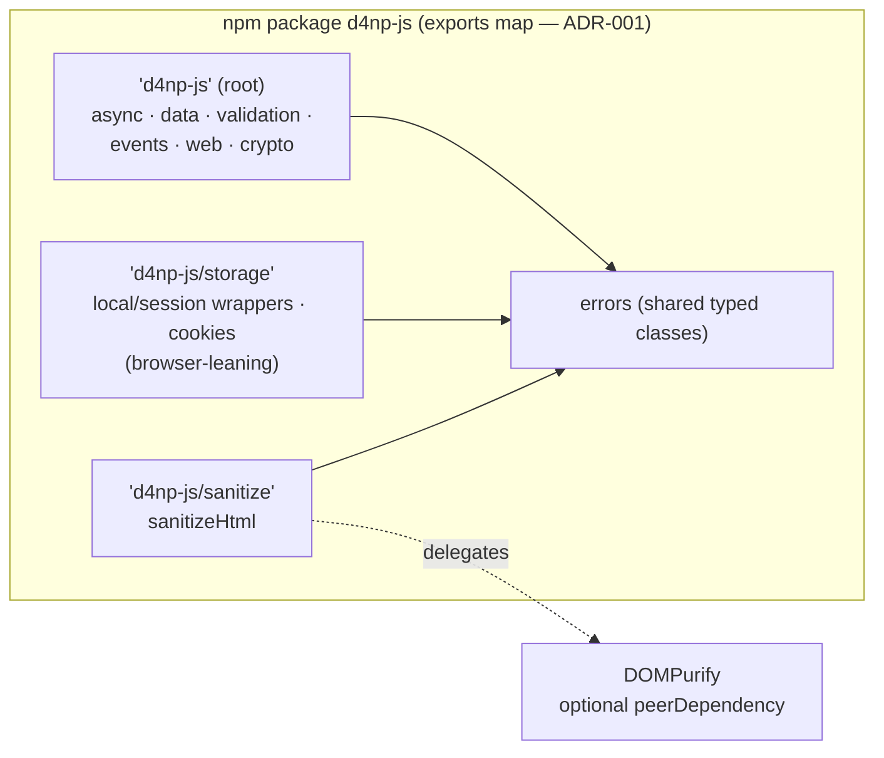

# Software Specification: d4np-js (JavaScript Core & Async Utilities Library)

| | |
|---|---|
| **Version** | 2.0 (addresses spec-review issue #10) |
| **Date** | 2026-07-14 |
| **Status** | Reviewed draft |
| **ADRs** | [ADR-001: Dual ESM/CJS build](adr/d4np_js_adr_001_build_strategy.md) · [ADR-002: deepClone on structuredClone](adr/d4np_js_adr_002_deepclone.md) · [ADR-003: Sanitization delegation](adr/d4np_js_adr_003_sanitization.md) |

## 1. Description & Design Philosophy
`d4np-js` is a universal JavaScript library (Node.js + modern browsers) providing async utilities, data-manipulation functions, and event helpers, published as **`d4np-js`** on npm with **named exports only** (no default aggregate object — v1's aggregate default export defeated tree-shaking).

Design principles — **scoped honestly** *(v1 declared "pure functions, no side effects" for a library containing an EventEmitter and storage wrappers)*:
* **Pure by default, stateful by contract:** the *data* and *async-combinator* modules are pure (inputs never mutated, no ambient state); the *events*, *storage*, *http*, and *cookie* modules are inherently stateful and are labeled as such in the §3 contract table. The immutability promise applies exactly where the table says it does.
* **Modern compatibility:** hybrid ESM/CJS via a `package.json` `exports` map ([ADR-001](adr/d4np_js_adr_001_build_strategy.md)); `sideEffects: false`; bundled `.d.ts`.
* **Optimized async:** combinators over native Promises with first-class **`AbortSignal` cancellation** and typed error classes (§3).

### 1.1 Runtime support matrix (absent in v1)
| Runtime | Minimum | Why |
|---|---|---|
| Node.js | **≥ 18 LTS** | native global `fetch` (item 16); `structuredClone` (item 9); Web Crypto via `node:crypto` `webcrypto` |
| Browsers | last 2 evergreen (Chromium/Firefox) + Safari ≥ 15.4 | `structuredClone`, `AbortSignal.timeout`, ES2022 baseline |
| Crypto source (items 18–19) | `globalThis.crypto` in browsers; `webcrypto` from `node:crypto` in Node via a conditional-exports shim | one Web Crypto API surface everywhere |
| TypeScript | ≥ 5.0 (types generated from source) | `exports`-aware resolution |

---

## 2. Functional Specification (25 items)

### Async & Control Flow (pure combinators; all accept `AbortSignal`)
1. **`delay(ms, opts?: {signal?})`** — Promise resolved after `ms`; rejects `AbortError` on signal.
2. **`timeout(promise, ms, opts?)`** — rejects with **`TimeoutError`** if unsettled within `ms` (implemented on `AbortSignal.timeout`; the underlying operation receives the signal so it can actually stop, not just be abandoned).
3. **`retry(fn, options)`** — exponential backoff + full jitter; `options: {retries, minDelay, maxDelay, signal, onAttempt}`; exhaustion rejects **`RetryExhaustedError`** carrying `.attempts` and `.errors[]`.
4. **`parallelLimit(tasks, limit, opts?)`** — bounded concurrency. **Partial-failure policy explicit** *(v1 undefined)*: default **fail-fast** (first rejection aborts pending tasks via the shared signal and rejects); `{settle: true}` returns `PromiseSettledResult[]` instead.
5. **`asyncQueue(opts?)`** — FIFO serial queue; `push` returns the task's Promise; `onIdle()`, `size`, abort drains pending with `AbortError`.

### Events & Communication (stateful by contract)
6. **`EventEmitter<EventMap>`** — minimal **typed** emitter (`on/once/off/emit`). Kept custom rather than `EventTarget`: typed payloads per event name and zero-allocation `emit` are the point; the trade-off is documented inline (no DOM-event interop; use `EventTarget` when you need bubbling/composition).
7. **`debounce(fn, delay, opts?)`** — trailing-edge default, `{leading, maxWait}`; exposes `.cancel()`/`.flush()`.
8. **`throttle(fn, interval, opts?)`** — at most one call per interval; `.cancel()`.

### Data Manipulation (pure)
9. **`deepClone(obj)`** — thin wrapper over **native `structuredClone`** ([ADR-002](adr/d4np_js_adr_002_deepclone.md); v1 specified a custom implementation without ever mentioning the platform API that already handles its listed edge cases — dates, regexes, circular refs). Unsupported types (functions, DOM nodes, class methods) throw a typed **`CloneError`** naming the offending path instead of silently degrading.
10. **`deepMerge(target, source)`** — recursive merge returning a **new** object (inputs untouched); arrays replaced not concatenated (documented; `{arrayMerge}` option).
11. **`pick(obj, keys)` / `omit(obj, keys)`** — new filtered objects; type-narrowing signatures.
12. **`groupBy(array, iteratee)`** — returns `Map<K, T[]>` (not a plain object — avoids prototype-key pitfalls).
13. **`uniq(array, iteratee?)`** — SameValueZero uniqueness, optional key extractor.

### Validation & Light Typing (pure)
14. **`isObject(val)` / `isEmpty(val)`** — type-guard signatures (`val is Record<string, unknown>`).
15. **`validateEmail(email)`** — syntactic check with a **linear-time, backtracking-free pattern** *(v1's "optimized regex" carried no ReDoS constraint — email regexes are a classic catastrophic-backtracking vector)*: character-class-based RFC 5322 *practical subset* (no quoted local parts, no comments), length caps (64 local / 255 domain) enforced before matching; ReDoS resistance verified by property test (§7).

### Web & API Helpers (stateful by contract)
16. **`httpClient`** — `fetch` wrapper. **Timeout corrected** *(fetch has no timeout option — v1 never mentioned the mechanism)*: per-request and default timeouts implemented via **`AbortController`**, caller signals merged with the timeout signal. **Auth corrected:** the client **stores no tokens**; callers provide `auth: () => string | Promise<string>` and the client attaches `Authorization: Bearer …` per request — storage policy stays with the application. Automatic JSON parsing with `content-type` checks; non-2xx rejects **`HttpError`** carrying `status`, `body`.
17. **`urlSearchParams(obj)`** — flat object → query string (arrays as repeated keys; `null`/`undefined` skipped — documented).

### Crypto & Security
18. **`uuid()`** — UUID v4 via `crypto.getRandomValues`/`randomUUID` (Web Crypto both runtimes, §1.1); never `Math.random`.
19. **`hashString(str, algorithm = 'SHA-256')`** — async digest via Web Crypto `subtle.digest`; hex output; algorithms limited to `SHA-256/384/512`.

### Diagnostics & Storage
20. **`measure(fn, opts?)`** — sync/async execution timing on `performance.now()`; returns `{result, ms}`.
21. **`localStorageWrapper`** — safe interface with in-memory fallback when storage is unavailable (private browsing, disabled); JSON (de)serialization with quota-error surfacing (`StorageError`).
22. **`sessionStorageWrapper`** — same contract over `sessionStorage`.
23. **`cookieHelper`** — read/write/delete cookies **accessible via `document.cookie` only**. **v1's HttpOnly claim removed — it was factually wrong:** HttpOnly cookies are invisible to client-side JavaScript *by design*; no library can read them, and this one does not claim to. Helpers cover `Secure`/`SameSite`/`Max-Age`/`Path` attributes; browser-only entry point (no-ops with a warning in Node).
24. **`sanitizeHtml(html, opts?)`** — **allowlist-based** sanitization *(v1's blocklist tag-stripping was a known-insufficient defense: event-handler attributes, `javascript:` URIs, SVG vectors, and mutation XSS all survive tag removal)*. Per [ADR-003](adr/d4np_js_adr_003_sanitization.md) the library **delegates to DOMPurify** (optional peer dependency, separate entry `d4np-js/sanitize`) with a curated default allowlist. Non-goals stated: no CSS sanitization, no URL rewriting, browser-first (Node requires a DOM via `jsdom` and is documented, not implied). Sanitizers are not reimplemented in-house.
25. **`parseDuration(str)`** — `"2h" | "30m" | "5s" | "1h30m"` → milliseconds; invalid input throws `DurationParseError` (never `NaN`).

---

## 3. API Contract Summary
Error classes exported: `TimeoutError`, `RetryExhaustedError`, `AbortError` (re-exported DOM convention), `HttpError`, `CloneError`, `StorageError`, `DurationParseError` — all extend `D4npError` with a stable `.code`.

| Module group | Purity | Cancellation | Failure contract |
|---|---|---|---|
| async (1–5) | pure combinators | `AbortSignal` on every API | typed errors above; fail-fast vs settle documented (item 4) |
| events (6–8) | stateful | `.cancel()` on 7–8 | listener exceptions isolated per listener, reported via `emitter.on('error')` |
| data (9–13) | pure, inputs never mutated | — | `CloneError` with path |
| validation (14–15) | pure | — | boolean returns, never throws |
| web (16–17) | stateful (16) / pure (17) | signal-merged timeouts | `HttpError{status, body}` |
| crypto (18–19) | pure | — | rejects on unsupported algorithm |
| storage/cookies (21–23) | stateful | — | `StorageError` on quota; silent fallback documented |

---

## 4. Architecture (C4 Component View — entry points & tree-shaking boundaries)

Subpath entries keep browser-only and peer-dependent code out of the root import; `sideEffects: false` + named exports make every function individually shakeable (verified in CI, §7).

---

## 5. Non-Functional Requirements
| ID | Target | Verified by |
|---|---|---|
| NFR-01 | Bundle budgets (min+gzip): root entry full import ≤ 6 kB; any single function ≤ 1 kB after shaking; `/storage` ≤ 2 kB | `size-limit` gate in CI |
| NFR-02 | Tree-shakability: importing one named export pulls zero unrelated modules | `agadoo` + size-limit scenario builds |
| NFR-03 | Coverage ≥ 95% lines/branches | vitest + c8 gate |
| NFR-04 | Performance parity: items 3–4 within 10% of `p-retry`/`p-limit`; items 9–13 within 10% of lodash equivalents (or faster) | vitest bench, pinned baselines, nightly regression gate |
| NFR-05 | `validateEmail` worst-case linear: 10⁶ adversarial inputs (nested quantifier patterns) each < 1 ms | property test in suite |
| NFR-06 | Zero runtime dependencies in the root entry (DOMPurify is peer + subpath only) | package.json audit in CI |

---

## 6. API Example (named exports, real package name — v1 imported a repo path into a default object)
```javascript
import { parallelLimit, httpClient, TimeoutError } from 'd4np-js';

const urls = ['/api/1', '/api/2', '/api/3', '/api/4'];
const client = httpClient.create({ timeout: 5_000, auth: () => getAccessToken() });

const controller = new AbortController();

try {
  // At most 2 concurrent fetches; first failure aborts the rest (fail-fast default).
  const results = await parallelLimit(
    urls.map((url) => () => client.get(url)),
    2,
    { signal: controller.signal },
  );
  console.log('All downloads completed:', results);
} catch (err) {
  if (err instanceof TimeoutError) console.error('A request timed out:', err);
  else throw err;
}
```

---

## 7. Verification, CI & Release Engineering
* **Tests:** vitest, Node 18/20/22 matrix + browser smoke via Playwright (Chromium/Firefox/WebKit) for storage/cookie/sanitize entries; property tests (fast-check) for `validateEmail` ReDoS (NFR-05), `deepMerge` non-mutation, `parseDuration` grammar.
* **Quality gates per PR:** typecheck (`tsc --noEmit`), ESLint, coverage ≥ 95%, `size-limit` budgets (NFR-01), `agadoo` shakeability (NFR-02), `publint` + `arethetypeswrong` for the exports map.
* **Benchmarks:** vitest bench vs pinned lodash/p-limit/p-retry, nightly, > 10% regression fails (NFR-04).
* **Release:** changesets-driven versioning (SemVer) and changelog; npm publish with **provenance** (`--provenance`) from CI OIDC, maintainer 2FA enforced; supply-chain: lockfile-only installs, `npm audit` gate.

---

## 8. Decision Log
* [ADR-001 — Build & packaging: dual ESM/CJS via exports map, named exports only](adr/d4np_js_adr_001_build_strategy.md)
* [ADR-002 — `deepClone` wraps native `structuredClone` with typed errors](adr/d4np_js_adr_002_deepclone.md)
* [ADR-003 — Sanitization delegated to DOMPurify behind an allowlist wrapper](adr/d4np_js_adr_003_sanitization.md)
